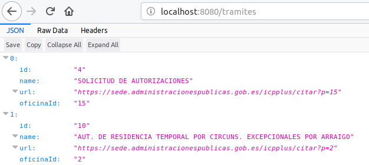

# API using GO

Simple API that crawles the website [sede.administracionespublicas.gob.es](https://sede.administracionespublicas.gob.es) and publish the offices and procedures that each one can deal with.

# Install

    REPO_URL=github.com/humbertodias/go-nie-api
    go get $REPO_URL && go install $REPO_URL

# Run

    go-nie-api

# Api

    http://localhost:8080/provincias

    http://localhost:8080/tramites

    http://localhost:8080/oficinas

Using docker

    make docker-build
    make docker-run

# Ref

[building-a-web-http-server-with-go](https://itnext.io/building-a-web-http-server-with-go-6554029b4079)